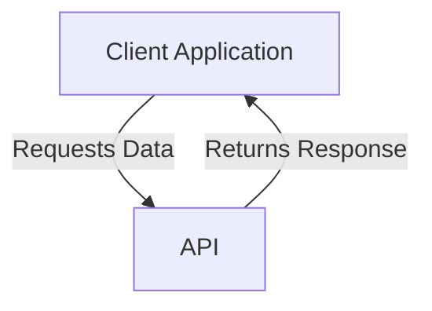
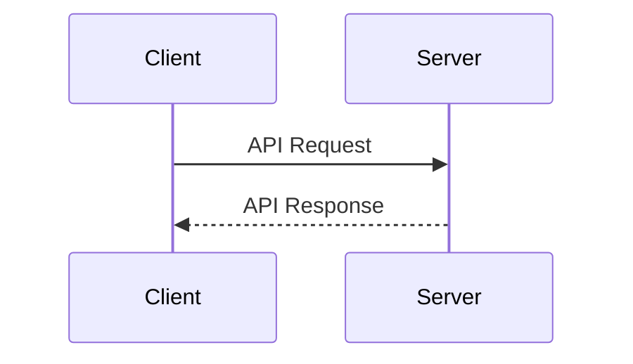

## What is the Treble API?

The Treble API is an application programming interface that allows developers to interact with the Treble platform. The Treble API adds functionality to the Treble platform so you can implement more complex use cases.

### What is an API?

An API (Application Programming Interface) is a set of rules and protocols that allows different applications to communicate with each other. APIs define how developers can interact with a service or platform to access its functionalities.

### How is an API used?

APIs are used to send requests to a server and receive responses. This allows applications to access external data and services without needing to know the internal details of how they work.

### Importance of APIs in the context of Treble

- **Integration:** APIs allow Treble to be integrated with other applications and services, facilitating process automation and data exchange.
- **Extensibility:** Developers can extend Treble's functionalities through the use of APIs, creating customized solutions for their specific needs.
- **Efficiency:** APIs allow access to Treble's functionalities efficiently, reducing the need to develop solutions from scratch.

### Example of Use in Treble

In the context of Treble, APIs are fundamental for configuring webhooks that notify developers about important events, such as the reading or delivery of messages. This allows companies to react in real-time to user interactions.

In the following sections, you will find information about the available endpoints, how to configure webhooks, and how to interact with them. 