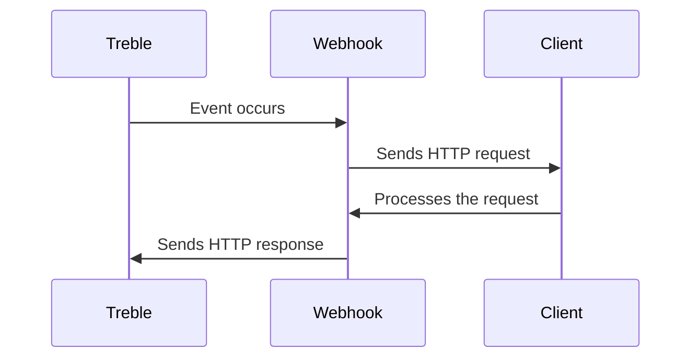

## What are webhooks?

Webhooks are a way to receive real-time notifications about specific events on the Treble platform. Treble allows you to configure webhooks that can be used for multiple purposes, such as conversation event notifications, session updates, etc.

Treble uses a system to call your endpoint to notify you of events occurring on the platform.

### How do webhooks work?

When an event occurs in Treble, an HTTP POST request is sent to the configured webhook URL. This request contains information about the event, which your server can process to perform specific actions, such as updating a database or sending a notification.



### Benefits of using webhooks

- **Real-time efficiency:** Receive instant notifications about important events without needing to constantly query the API.
- **Automation:** Allows you to automate workflows by automatically triggering actions in response to events.
- **Flexibility:** Can be configured for a variety of events and customized according to business needs.

### Usage examples

- **Message notifications:** Receive alerts when a message is read or delivered.
- **Status updates:** Monitor changes in the status of a conversation or session.
- **Integrations:** Connect Treble with other applications or services to synchronize data or initiate processes.

With this additional information, you'll have a more complete understanding of how webhooks can be used to improve interaction with the Treble platform and automate processes in your system.

## What types of webhooks exist in Treble?

1. **Message read webhook:** This webhook is triggered when a user reads a message in a conversation.
2. **Message delivery webhook:** This webhook is triggered when a message is sent to a user.
3. **Opt-out webhook:** This webhook is triggered when a user opts not to receive more messages.
4. **Message response webhook:** Used to notify when a response is received for a specific message in one of your conversation flows.
5. **Conversation closed webhook:** This webhook is triggered when a conversation is closed.
5. **HSM state change webhook:** This webhook is triggered when an HSM changes state.

Some of the webhooks mentioned above must be configured within each specific flow of a conversation, while others act globally on the Treble platform. Here's a table to understand which webhooks can be configured in each case.

| Webhook | Configured in |
| ------- | -------------- |
| Message read webhook | Flow |
| Message delivery webhook | Flow |
| Message response webhook | Flow |
| Opt-out webhook | Flow |
| Conversation closed webhook | Globally in Treble |
| HSM state change webhook | Globally in Treble |

## What should I consider when configuring a webhook?

You should have knowledge of how to receive and process HTTP requests. Additionally, you should have a server or service that can receive and process these requests.

### Security

- **Authentication:** Ensure that requests come from a trusted source. You can use authentication tokens or secret keys to verify the authenticity of requests.
- **Encryption:** Use HTTPS to encrypt requests and protect data in transit.

### Data Validation

- **Verify received data:** Ensure that the data in the request is valid and complete before processing it.
- **Error handling:** Implement robust error handling to respond appropriately to malformed or unauthorized requests.

### Code Example

Here's a basic example of how you might set up an endpoint to receive a webhook in Node.js:

```javascript
const express = require('express');
const app = express();
app.use(express.json());

app.post('/webhook', (req, res) => {
    const { event, data } = req.body;

    // Verify the authenticity of the request
    if (!isValidRequest(req)) {
        return res.status(401).send('Unauthorized');
    }

    // Process the event
    switch (event) {
        case 'message_read':
            handleMessageRead(data);
            break;
        // Handle other events
        default:
            console.log('Unrecognized event:', event);
    }

    res.status(200).send('Event processed');
});

function isValidRequest(req) {
    // Implement validation logic
    return true;
}

function handleMessageRead(data) {
    console.log('Message read:', data);
}

app.listen(3000, () => {
    console.log('Server listening on port 3000');
});
```

### Testing

- **Test your endpoint:** Use tools like Postman or curl to send test requests and ensure your server responds correctly.
- **Simulate different scenarios:** Make sure your system properly handles different types of events and errors.

With these tips and examples, you'll be better prepared to configure and handle webhooks effectively.

## Next steps

In the following articles, we show you how to configure each of the webhooks mentioned above. 