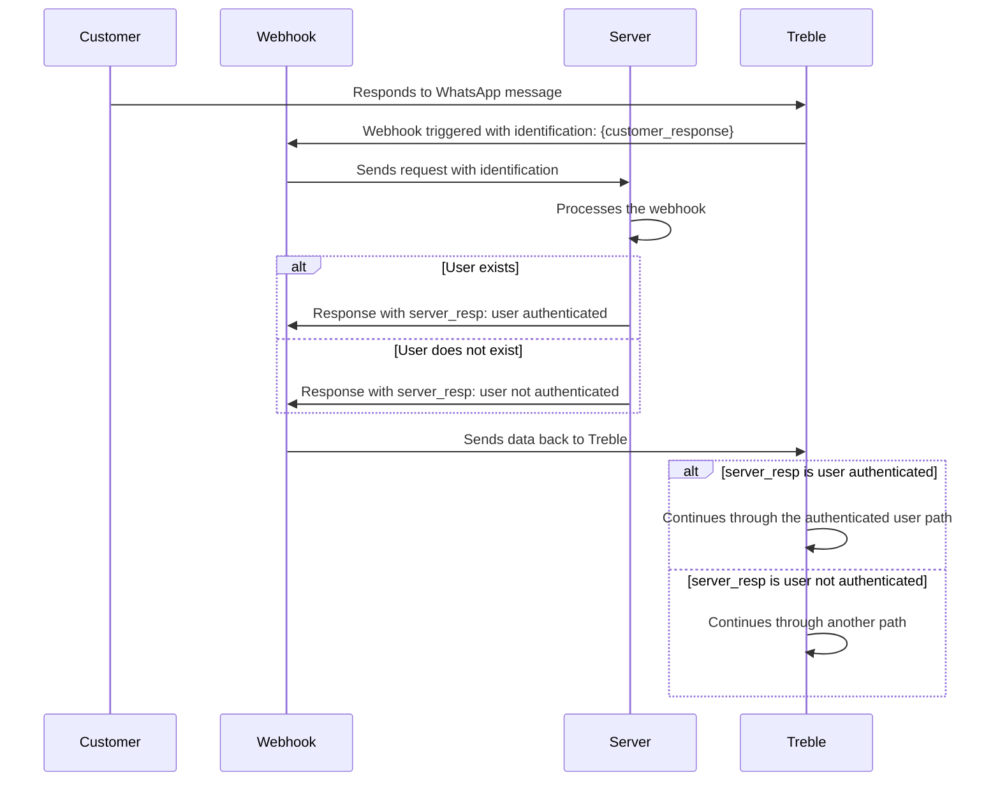

## How does it work?

When a user responds to a message, we can configure a webhook to be triggered and send an HTTP request to your endpoint configured in Treble. This webhook is one of the most important ones for implementing complex use cases, such as process automation or integration with other applications.

For example, you can configure a webhook to capture a customer's response when they are asked for their identification number. Treble will send an HTTP request to your endpoint configured in Treble with the customer's response, which you can process in your application. Subsequently, you can even return information to the Treble conversation (flow) to display dynamic information obtained by your server, or route the conversation through another path.

### Message response webhook flow diagram

In this example, the customer responds to a WhatsApp message with their identification number. Treble sends an HTTP request to your endpoint configured in Treble with the customer's response containing the identification number. Your server processes it and returns information to Treble to continue the conversation.




## How to configure a message response webhook?

<Steps>
    <Step title="Log in to Treble.ai">
        Log in to Treble.ai through the following URL: <a class="article-link" href="https://app.treble.ai"><p>https://app.treble.ai</p><Icon icon="arrow-up-right-from-square" iconType="solid" /></a>
    </Step>
    <Step title="Create a flow">
        Go to the "Conversations" section and click on the **"Create Conversation"** button. You can also configure a message read webhook in an existing flow. For this, go to the "Flows" section and click on the **"Edit" <Icon icon="pencil" iconType="solid" />** button of your flow.

        
    </Step>
    <Step title="Add message blocks">
        Let's add the first message block. Click on the **"Add block" <Icon icon="plus" iconType="solid" />** button. In this case, we will add a message template (HSM) previously created and approved by Meta. Then we will connect a simple message block with the HSM block. Here we will ask for the customer's identification number.

        
    </Step>
    <Step title="Activate webhook and add endpoint">
        Now, let's double-click on the arrow <Icon icon="arrow-right" iconType="solid" /> that comes out of the message block and connects to the response block. A text field will appear at the top. In this field, we will add the endpoint to which you want the HTTP request to be sent when this message is read.

        
    </Step>
    <Step title="Specify the variable to capture the response">
        It is necessary to specify the variable to capture the customer's response. Let's double-click on the question block where we are asking for the identification number. In the panel that appears on the left, let's click on the **"Save response as variable"** option. Two fields will appear:

        - **"Response type"**: Here you can choose the type of response you want to capture. In this case, we will choose **"Number"**.
        - **"Variable name"**: Here you can add the name of the variable you want to save. In this case, we will add `client_id`.

        

        The use of variables in Treble is a key concept for process automation. You can read more about them at:
        <Card 
            title="Variables in Treble" 
            icon="book-open"
            href="/en/docs/build-with-treble/features/variables"
        >
            Learn more about variables in Treble.
        </Card>
    </Step>
    <Step title="Save changes">
        For the webhook to be activated, you must save the changes. If you are in a new flow, click on the **"Publish Conversation"** button to save the flow. If you are in an existing flow, click on the **"Save"** button to save the changes.

        <Check>
            Done! Now, when someone responds to your message, the webhook will be triggered and will send an HTTP request to your endpoint configured in Treble. The request body will contain information about the response event.
        </Check>
    </Step>
</Steps>

<Card 
    title="Message response webhook body" 
    icon="book-open"
    href="/en/api-reference/webhooks/message-response"
>
    Learn more about the message response webhook body.
</Card>

## Advanced Tutorial - Response from your server

In the previous step-by-step, we saw how to configure a message response webhook in Treble. Now, let's see how to process the customer's response on your server. For this, it is necessary that your server has a public endpoint to which the HTTP request can be sent.

### Step by Step

1. **Configure your server:**
   Make sure your server is configured to receive HTTP requests. You can use a framework like Express in Node.js to facilitate this process.

2. **Create an endpoint for the webhook:**
   Define an endpoint on your server that can receive webhook requests.

3. **Process the request:**
   Extract the relevant information from the request and perform the necessary actions, such as verifying if the user exists.

4. **Send a response to Treble:**
   Return a response to Treble with the processed information, such as the user's authentication status. The response must be a JSON with the following format:

   ```json
    {
        "user_session_keys":[
            {
                "key":"server_user_valid",
                "value":"yes"
            }
        ]
    }
   ```

The `user_session_keys` is an array of objects that contains the key and value of the response. For this example, the key should be `server_user_valid` and the value should be `yes` if the user exists or `no` if they don't. However, you can send back to Treble any information you need to continue the conversation. This response can contain more variables that can be used in the flow.

Example:

```json
{
    "user_session_keys":[
        {
            "key":"user_name",
            "value":"John Smith"
        },
        {
            "key":"last_purchase_date",
            "value":"2025-01-01"
        }
    ]
}
```

### Code Example

Here is a basic example of how you could implement this in Node.js:

```javascript
const express = require('express');
const app = express();
app.use(express.json());

app.post('/webhook', (req, res) => {
    // Extract the user identification from the user_session_keys
    const identification = req.body.user_session_keys.find(key => key.key === 'client_id')?.value;

    // Simulate user verification
    const userExists = verifyUser(identification);

    // Prepare the response for Treble
    const server_resp = userExists ? 'yes' : 'no';

    // Send the response back to Treble with the correct structure
    res.json({
        user_session_keys: [
            {
                key: "server_user_valid",
                value: server_resp
            }
        ]
    });
});

function verifyUser(identification) {
    // Logic to verify if the user exists
    // Here you can query a database or an external service
    return identification === '12345'; // Example verification
}

app.listen(3000, () => {
    console.log('Server listening on port 3000');
});
```

5. Back in your conversation (flow) in Treble, we connect a conditions block to evaluate the server's response. Note how the `server_user_valid` variable is a session variable that is saved in the flow and is the response that is sent to the server. The conditions block is an "If" type block and evaluates if the `server_user_valid` variable is equal to `yes`. If so, it continues along the authenticated user path. If not, it continues along another path.


<Check>
    Done! We have configured a message response webhook in Treble. Now, when someone responds to your message, the webhook will be triggered and will send an HTTP request to your endpoint configured in Treble with the customer's response. Your server processes it and returns information to Treble to continue the conversation.
</Check>

## Keep in mind

- You must configure the response webhook for each response (arrow <Icon icon="arrow-right" iconType="solid" />) that comes out of a message block. If you configure it on a single response or the first one, it will only be activated for the first response.

In the following image, you can see how you should configure the response webhook for each of the 3 responses that come out of a message block.


<Warning>
    Your server's response to the webhook cannot take more than 10 seconds. If your server takes more than 10 seconds to respond, the webhook will be marked as timeout and the conversation flow in Treble will continue. You can extend the response time with the `[REQUEST_TRIGGER]` option. For more information, you can read the article: <a class="article-link" href="/en/api-reference/webhooks/request-trigger">Stop Treble conversation and wait for response from your server</a>.
</Warning> 