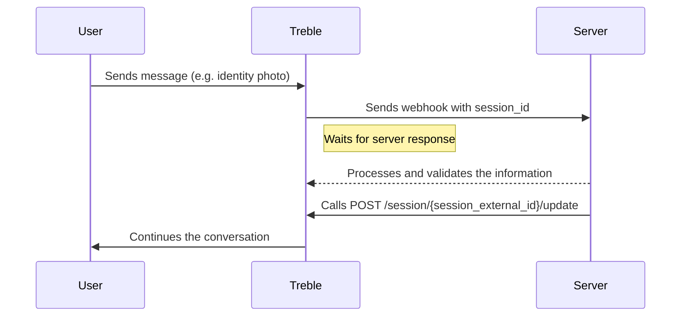

## Request Trigger

Every Treble webhook expects a response from your server in less than 10 seconds. If the time exceeds, the webhook will be marked as timeout and the flow conversation in Treble will continue.

However, there are times when Treble's WhatsApp conversation must wait for your server's response. For example, when a client sends a photo of their national identity to validate their account and your server needs to process and validate the image. This might take more than 10 seconds.

For this, you can stop the Treble conversation and wait for your server's response with the `[REQUEST_TRIGGER]` option. With the `[REQUEST_TRIGGER]` option, Treble will wait for your server to call the `POST /session/{session_external_id}/update` endpoint to continue the conversation.



## How to configure a request trigger?

The request trigger configuration consists of two parts:

1. The webhook configuration that is done on the path connecting to the node (message block) where you want to stop the conversation.
2. The message block configuration that has a single response option which is the text: `[REQUEST_TRIGGER]`.

In the following image, you can see how you should configure your message flow to stop and wait for your server's response.


<Warning>
    Note that the message block you should use to stop the conversation and wait for your server's response must be a non-interactive message block. That is, choose the **Message with options** option and not **Interactive Buttons**.

    
</Warning>

Once this is done, when your user passes through the path connecting to the message block with the text `[REQUEST_TRIGGER]`, Treble will stop the conversation and wait for your server's response.

### How to continue the conversation?

To continue the conversation, you need to get the `session_id` of the Treble session that comes as part of the webhook request body.

For example:

```json
{
   "country_code": "+57",
   "cellphone":"3161234567",
   "session_id" : "abcsderfwer3252432423-1324325235",
   "conversation_id": 1234,
   "question": {
      "type": "open",
      "text": "Hello world"
   }
   "timeout_at": "2021-10-07 08:53:22.572123",
   "user_session_keys":[]
}
```

Here we need to extract the `session_id` and use it to call the `POST /session/{session_external_id}/update` endpoint.

<Card 
    title="Update a session" 
    icon="code"
    href="/en/api-reference/endpoints/session-update"
>
    Update a session to continue the conversation.
</Card>

Remember that when making the call to the `POST /session/{session_external_id}/update` endpoint, you can also include in the request body the `user_session_keys`, that is, session variables that can be used to continue the conversation.

<Check>
   Done! You have successfully configured a request trigger in your message flow.
</Check> 