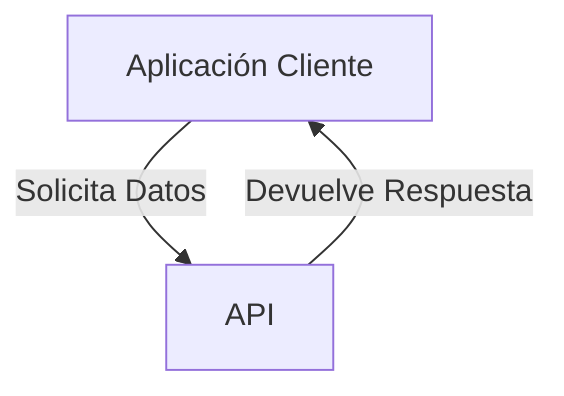
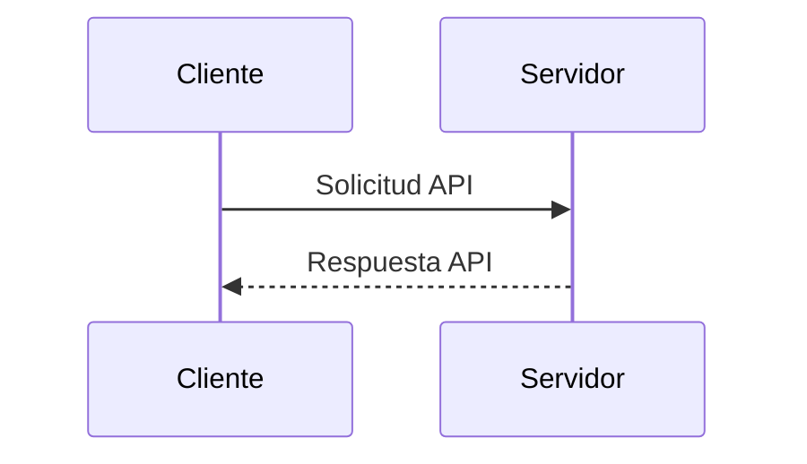

## ¿Qué es la API de Treble?

La API de Treble es una interfaz de programación de aplicaciones que permite a los desarrolladores interactuar con la plataforma Treble. La API de Treble agrega funcionalidades a la plataforma Treble para que puedas implementar casos de uso mas complejos.

### ¿Qué es una API?

Una API (Interfaz de Programación de Aplicaciones) es un conjunto de reglas y protocolos que permite a diferentes aplicaciones comunicarse entre sí. Las APIs definen cómo los desarrolladores pueden interactuar con un servicio o plataforma para acceder a sus funcionalidades.

### ¿Cómo se usa una API?

Las APIs se utilizan para enviar solicitudes a un servidor y recibir respuestas. Esto permite a las aplicaciones acceder a datos y servicios externos sin necesidad de conocer los detalles internos de cómo funcionan.

### Importancia de las APIs en el contexto de Treble

- **Integración:** Las APIs permiten integrar Treble con otras aplicaciones y servicios, facilitando la automatización de procesos y el intercambio de datos.
- **Extensibilidad:** Los desarrolladores pueden extender las funcionalidades de Treble mediante el uso de APIs, creando soluciones personalizadas para sus necesidades específicas.
- **Eficiencia:** Las APIs permiten acceder a las funcionalidades de Treble de manera eficiente, reduciendo la necesidad de desarrollar soluciones desde cero.

### Ejemplo de Uso en Treble

En el contexto de Treble, las APIs son fundamentales para configurar webhooks que notifican a los desarrolladores sobre eventos importantes, como la lectura o entrega de mensajes. Esto permite a las empresas reaccionar en tiempo real a las interacciones de los usuarios.

En las siguientes secciones, podrás encontrar información sobre los endpoints disponibles, cómo configurar webhooks y cómo interactuar con ellos.