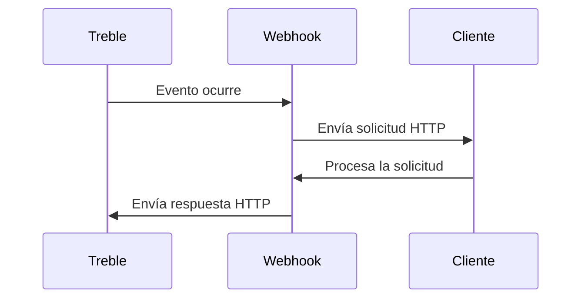

## ¿Qué son los webhooks?

Los webhooks son una forma de recibir notificaciones en tiempo real sobre eventos específicos en la plataforma Treble. Treble te permite configurar webhooks que pueden ser usados para múltiples propósitos, como notificaciones de eventos de conversaciones, actualizaciones de sesiones, etc.

Treble utiliza el sistema de realizar un llamado a tu endpoint para poderte notificar de los eventos que se están sucediendo en la plataforma.

### ¿Cómo funcionan los webhooks?

Cuando ocurre un evento en Treble, se envía una solicitud HTTP POST a la URL del webhook configurado. Esta solicitud contiene información sobre el evento, que tu servidor puede procesar para realizar acciones específicas, como actualizar una base de datos o enviar una notificación.



### Beneficios de usar webhooks

- **Eficiencia en tiempo real:** Recibe notificaciones instantáneas sobre eventos importantes sin necesidad de consultar constantemente la API.
- **Automatización:** Permite automatizar flujos de trabajo al desencadenar acciones automáticamente en respuesta a eventos.
- **Flexibilidad:** Se pueden configurar para una variedad de eventos y personalizar según las necesidades del negocio.

### Ejemplos de uso

- **Notificaciones de mensajes:** Recibir alertas cuando un mensaje es leído o entregado.
- **Actualizaciones de estado:** Monitorear cambios en el estado de una conversación o sesión.
- **Integraciones:** Conectar Treble con otras aplicaciones o servicios para sincronizar datos o iniciar procesos.

Con esta información adicional, tendrás una comprensión más completa de cómo los webhooks pueden ser utilizados para mejorar la interacción con la plataforma Treble y automatizar procesos en tu sistema.

## ¿Qué tipo de webhooks existen en Treble?

1. **Webhook de lectura de mensaje:** Este webhook se activa cuando un usuario lee un mensaje en una conversación.
2. **Webhook de entrega de mensaje:** Este webhook se activa cuando un mensaje es enviado a un usuario.
3. **Webhook de opt-out:** Este webhook se activa cuando un usuario opta por no recibir más mensajes.
4. **Webhook de respuesta de un mensaje:** Utilizado para notificar cuando se reciba una respuesta de un mensaje específico de uno de tus flujos de conversación.
5. **Webhook de cierre de conversación:** Este webhook se activa cuando una conversación es cerrada.
5. **Webhook cambio de estado de HSM:** Este webhook se activa cuando un HSM cambia de estado.

Algunos de los webhooks mencionados anteriormente se deben configurar dentro de cada flujo específico de una conversación, mientas que otros actuan de forma global en la plataforma Treble. Te mostramos una tabla para entender cuales son los webhooks que se pueden configurar en cada caso.

| Webhook | Configurado en |
| ------- | -------------- |
| Webhook de lectura de mensaje | Flujo |
| Webhook de entrega de mensaje | Flujo |
| Webhook de respuesta de un mensaje | Flujo |
| Webhook de opt-out | Flujo |
| Webhook de cierre de conversación | Globalmente en Treble |
| Webhook cambio de estado de HSM | Globalmente en Treble |

## ¿Qué debo tener en cuenta para configurar un webhook?

Debes tener conocimiento de cómo recibir y procesar solicitudes HTTP. Adicionalmente, debes tener un servidor o servicio que pueda recibir y procesar estas solicitudes.

### Seguridad

- **Autenticación:** Asegúrate de que las solicitudes provienen de una fuente confiable. Puedes usar tokens de autenticación o claves secretas para verificar la autenticidad de las solicitudes.
- **Cifrado:** Utiliza HTTPS para cifrar las solicitudes y proteger los datos en tránsito.

### Validación de Datos

- **Verifica los datos recibidos:** Asegúrate de que los datos en la solicitud sean válidos y completos antes de procesarlos.
- **Manejo de errores:** Implementa un manejo de errores robusto para responder adecuadamente a solicitudes malformadas o no autorizadas.

### Ejemplo de Código

Aquí tienes un ejemplo básico de cómo podrías configurar un endpoint para recibir un webhook en Node.js:

```javascript
const express = require('express');
const app = express();
app.use(express.json());

app.post('/webhook', (req, res) => {
    const { event, data } = req.body;

    // Verifica la autenticidad de la solicitud
    if (!isValidRequest(req)) {
        return res.status(401).send('Unauthorized');
    }

    // Procesa el evento
    switch (event) {
        case 'message_read':
            handleMessageRead(data);
            break;
        // Maneja otros eventos
        default:
            console.log('Evento no reconocido:', event);
    }

    res.status(200).send('Evento procesado');
});

function isValidRequest(req) {
    // Implementa la lógica de validación
    return true;
}

function handleMessageRead(data) {
    console.log('Mensaje leído:', data);
}

app.listen(3000, () => {
    console.log('Servidor escuchando en el puerto 3000');
});
```

### Pruebas

- **Prueba tu endpoint:** Usa herramientas como Postman o curl para enviar solicitudes de prueba y asegurarte de que tu servidor responde correctamente.
- **Simula diferentes escenarios:** Asegúrate de que tu sistema maneje adecuadamente diferentes tipos de eventos y errores.

Con estos consejos y ejemplos, estarás mejor preparado para configurar y manejar webhooks de manera efectiva.

## Siguientes pasos

En los siguientes artículos te mostramos como configurar cada uno de los webhooks mencionados anteriormente.
