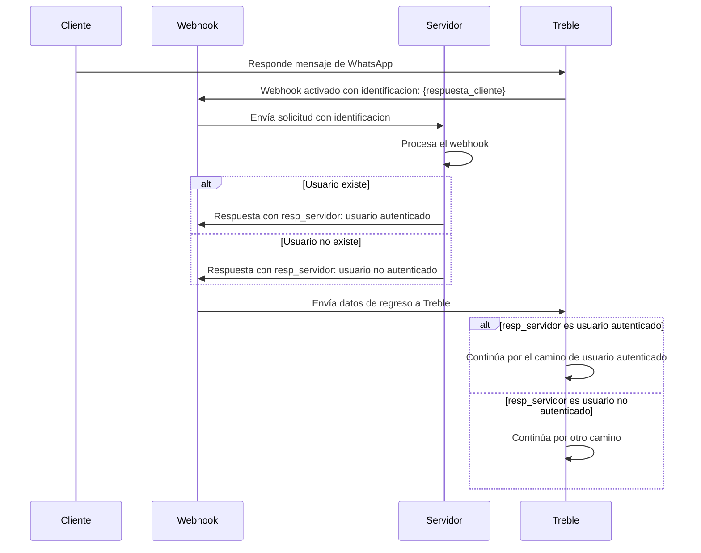

## ¿Cómo funciona?

Cuando un usuario responde a un mensaje, podemos configurar un webhook para que se active y se envíe una solicitud HTTP a tu endpoint configurado en Treble. Este webhook es uno de los mas importantes para implementar casos de uso complejos, como la automatización de procesos o la integración con otras aplicaciones.

Por ejemplo, puedes configurar un webhook para capturar la respuesta de un cliente cuando se le pide su número de identificación. Treble enviará una solicitud HTTP a tu endpoint configurado en Treble con la respuesta del cliente la cual puedes procesar en tu aplicación. Posteriormente, puedes incluso devolver información a la conversación (flujo) de Treble para mostrar información dinámica obtenida por tu servidor, o encaminar la conversación por otro camino.

### Diagrama de flujo de webhook de respuesta de mensaje

En este ejemplo, el cliente responde a un mensaje de WhatsApp con su número de identificación. Treble envía una solicitud HTTP a tu endpoint configurado en Treble con la respuesta del cliente con el número de identificación. Tu servidor la procesa y devuelve información a Treble para continuar la conversación.




## ¿Cómo configurar un webhook de respuesta de mensaje?

<Steps>
    <Step title="Ingresa a Treble.ai">
        Ingresa a Treble.ai por medio de la siguiente URL: <a class="article-link" href="https://app.treble.ai"><p>https://app.treble.ai</p><Icon icon="arrow-up-right-from-square" iconType="solid" /></a>
    </Step>
    <Step title="Creación de un flujo">
        Ve a la sección de "Conversaciones" y haz click en el botón **"Crear Conversación".** También puedes configurar un webhook de lectura de mensaje en un flujo existente. Para esto, ve a la sección de "Flujos" y haz click en el botón **"Editar" <Icon icon="pencil" iconType="solid" />** de tu flujo.

        
    </Step>
    <Step title="Agregar bloques de mensajes">
        Vamos a añadir el primer bloque de mensaje. Haz click en el botón **"Agregar bloque" <Icon icon="plus" iconType="solid" />**. En este caso, vamos a agregar una plantilla de mensaje (HSM) previamente creada y aprobada por Meta. Después vamos a conectar un bloque sencillo de mensaje con el bloque de HSM. Aqui vamos a preguntar por el número de identificación del cliente.

        
    </Step>
    <Step title="Activar webhook y agregar endpoint">
        Ahora, vamos a hacer doble click en la flecha <Icon icon="arrow-right" iconType="solid" /> que sale del bloque de mensaje y conecta con el bloque de respuesta. Se desplegará un campo de texto en la parte superior. En este campo, vamos a agregar el endpoint al que quieres que se envíe la solicitud HTTP cuando este mensaje sea leído.

        
    </Step>
    <Step title="Especificar la variable para capturar la respuesta">
        Es necesario especificar la variable para capturar la respuesta del cliente. Vamos a hacer doble click en el bloque de pregunta donde estamos pidiendo el número de identificación. En el panel que se despliega a la izquierda, vamos a hacer click en la opción **"Guardar respuesta como variable"**. Se van a desplegar dos campos:

        - **"Tipo de respuesta"**: Aquí puedes escoger el tipo de respuesta que quieres capturar. En este caso, vamos a escoger **"Número"**.
        - **"Nombre de la variable"**: Aquí puedes agregar el nombre de la variable que quieres que se guarde. En este caso, vamos a agregar `id_cliente`.

        

        El uso de variables en Treble es un concepto clave para la automatización de procesos. Puedes leer más sobre ellas en: 
        <Card 
            title="Variables en Treble" 
            icon="book-open"
            href="/es/docs/build-with-treble/features/variables"
        >
            Aprende más sobre variables en Treble.
        </Card>
    </Step>
    <Step title="Guardar cambios">
        Para que el webhook se active, debes guardar los cambios. Si estás en un flujo nuevo, haz click en el botón **"Publicar Conversación"** para guardar el flujo. Si estás en un flujo existente, haz click en el botón **"Guardar"** para guardar los cambios.

        <Check>
            ¡Listo! Ahora, cuando un responda a tu mensaje, el webhook se activará y enviará una solicitud HTTP a tu endpoint configurado en Treble. El cuerpo de la solicitud va a contener información del evento de respuesta.
        </Check>
    </Step>
</Steps>

<Card 
    title="Cuerpo de webhook de respuesta de mensaje" 
    icon="book-open"
    href="/es/api-reference/webhooks/message-response"
>
    Aprende más sobre el cuerpo de webhook de respuesta de mensaje.
</Card>

## Tutorial Avanzado - Respuesta de tu servidor

En el paso a paso anterior, vimos cómo configurar un webhook de respuesta de mensaje en Treble. Ahora, vamos a ver cómo procesar la respuesta del cliente en tu servidor. Para esto, es necesario que tu servidor tenga un endpoint público al que se pueda enviar la solicitud HTTP.

### Paso a Paso

1. **Configura tu servidor:**
   Asegúrate de que tu servidor esté configurado para recibir solicitudes HTTP. Puedes usar un framework como Express en Node.js para facilitar este proceso.

2. **Crea un endpoint para el webhook:**
   Define un endpoint en tu servidor que pueda recibir las solicitudes del webhook.

3. **Procesa la solicitud:**
   Extrae la información relevante de la solicitud y realiza las acciones necesarias, como verificar si el usuario existe.

4. **Envía una respuesta a Treble:**
   Devuelve una respuesta a Treble con la información procesada, como el estado de autenticación del usuario. La respuesta debe ser un JSON con el siguiente formato:

   ```json
    {
        "user_session_keys":[
            {
                "key":"servidor_usuario_valid",
                "value":"si"
            }
        ]
    }
   ```

Los `user_session_keys` es un arreglo de objetos que contiene la clave y el valor de la respuesta. Para este ejemplo, la clave debe ser `servidor_usuario_valid` y el valor debe ser `si` si el usuario existe o `no` si no existe. Sin embargo, puedes enviar de regreso a Treble cualquier información que necesites para continuar la conversación. Dicha respuesta puede contener mas variables que se puedan usar en el flujo.

Ejemplo:

```json
{
    "user_session_keys":[
        {
            "key":"nombre_usuario",
            "value":"Juan Perez"
        },
        {
            "key":"fecha_ultima_compra",
            "value":"2025-01-01"
        }
    ]
}
```

### Ejemplo de Código

Aquí tienes un ejemplo básico de cómo podrías implementar esto en Node.js:

```javascript
const express = require('express');
const app = express();
app.use(express.json());

app.post('/webhook', (req, res) => {
    // Extrae la identificación del usuario de los user_session_keys
    const identificacion = req.body.user_session_keys.find(key => key.key === 'id_cliente')?.value;

    // Simula la verificación del usuario
    const usuarioExiste = verificarUsuario(identificacion);

    // Prepara la respuesta para Treble
    const resp_servidor = usuarioExiste ? 'si' : 'no';

    // Envía la respuesta de vuelta a Treble con la estructura correcta
    res.json({
        user_session_keys: [
            {
                key: "servidor_usuario_valid",
                value: resp_servidor
            }
        ]
    });
});

function verificarUsuario(identificacion) {
    // Lógica para verificar si el usuario existe
    // Aquí puedes consultar una base de datos o un servicio externo
    return identificacion === '12345'; // Ejemplo de verificación
}

app.listen(3000, () => {
    console.log('Servidor escuchando en el puerto 3000');
});
```

5. De regreso en tu conversación (flujo) en Treble, conectamos un bloque de condiciones para evaluar la respuesta del servidor. Nota como la variable `servidor_usuario_valid` es una variable de sesión que se guarda en el flujo y es la respuesta que se envía al servidor. El bloque de condiciones es un bloque de tipo "Si" y evalua si la variable `servidor_usuario_valid` es igual a `si`. Si es así, se continúa por el camino de usuario autenticado. Si no, se continúa por otro camino.


<Check>
    ¡Listo! Hemos configurado un webhook de respuesta de mensaje en Treble. Ahora, cuando un responda a tu mensaje, el webhook se activará y enviará una solicitud HTTP a tu endpoint configurado en Treble con la respuesta del cliente. Tu servidor la procesa y devuelve información a Treble para continuar la conversación.
</Check>