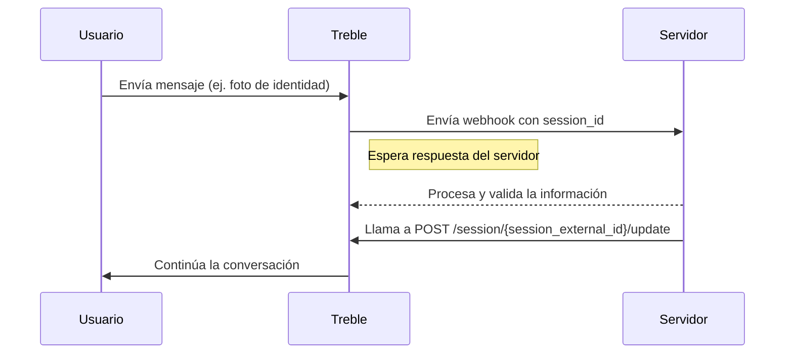

## Request Trigger

Todo webhook de Treble espera una respuesta de tu servidor en menos de 10 segundos. Si el tiempo se excede, el webhook se marcará como timeout y se continuará la conversación del flujo en Treble.

Sin embargo, hay veces donde la conversación de WhatsApp de Treble debe esperar a la respuesta de tu servidor. Por ejemplo, cuando un cliente envía una foto de su identidad nacional para validar su cuenta y tu servidor debe procesar la imagen y validarla. Es posible que esto tome más de 10 segundos.

Para esto, puedes detener la conversación de Treble y esperar la respuesta de tu servidor con la opción de `[REQUEST_TRIGGER]`. Con la opción de `[REQUEST_TRIGGER]`, Treble esperará a que tu servidor llame al endpoint de `POST /session/{session_external_id}/update` para continuar la conversación.



## ¿Cómo configurar un request trigger?

La configuración de un request trigger consta de dos partes:

1. La configuración del webhook que es efectuada en el camino que conecta al nodo (bloque de mensaje) donde quieres detener la conversación.
2. La configuración del bloque de mensaje que tiene una única opción de respuesta la cual es el texto: `[REQUEST_TRIGGER]`.

En la siguiente imagen, se ve cómo debes configurar tu flujo de mensaje para que se detenga y se espere la respuesta de tu servidor.


<Warning>
    Ten en cuenta que el bloque de mensaje que debes usar para detener la conversación y esperar la respuesta de tu servidor debe ser un bloque de mensaje no-interactivo. Es decir, escoge la opción **Mensaje con opciones** y no **Botones Interactivos**.

    
</Warning>

Una vez hecho esto, cuando tu usuario pase por el camino que conecta al bloque de mensaje con el texto `[REQUEST_TRIGGER]`, Treble detendrá la conversación y esperará la respuesta de tu servidor.

### ¿Cómo continuar la conversación?

Para continuar la conversación, debes obtener el `session_id` de la sesión de Treble que viene como parte del cuerpo de la solicitud del webhook.

Por ejemplo: 

```json
{
   "country_code": "+57",
   "cellphone":"3161234567",
   "session_id" : "abcsderfwer3252432423-1324325235",
   "conversation_id": 1234,
   "question": {
      "type": "open",
      "text": "Hello world"
   }
   "timeout_at": "2021-10-07 08:53:22.572123",
   "user_session_keys":[]
}
```

Aqui debemos extraer el `session_id` y usarlo para llamar al endpoint de `POST /session/{session_external_id}/update`.

<Card 
    title="Actualizar una sesión" 
    icon="code"
    href="/es/api-reference/endpoints/session-update"
>
    Actualizar una sesión para continuar la conversación.
</Card>

Recuerda que al hacer la llamada al endpoint de `POST /session/{session_external_id}/update`, puedes tambien incluir en el cuerpo de la solicitud el `user_session_keys`, es decir, variables de sesión que pueden ser usadas para continuar la conversación.

<Check>
   ¡Listo! Has logrado configurar un request trigger en tu flujo de mensaje.
</Check>