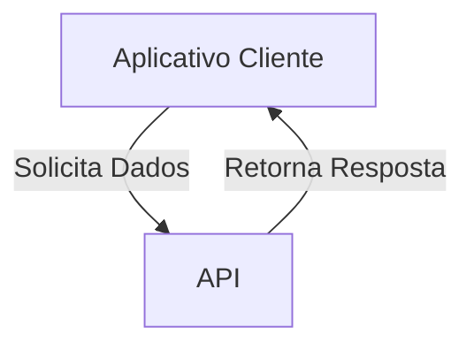
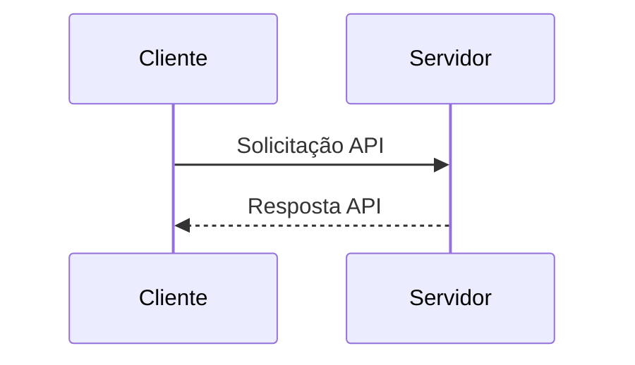

## O que é a API da Treble?

A API da Treble é uma interface de programação de aplicativos que permite aos desenvolvedores interagir com a plataforma Treble. A API da Treble adiciona funcionalidades à plataforma Treble para que você possa implementar casos de uso mais complexos.

### O que é uma API?

Uma API (Interface de Programação de Aplicativos) é um conjunto de regras e protocolos que permite que diferentes aplicativos se comuniquem entre si. As APIs definem como os desenvolvedores podem interagir com um serviço ou plataforma para acessar suas funcionalidades.

### Como se usa uma API?

As APIs são usadas para enviar solicitações a um servidor e receber respostas. Isso permite que os aplicativos acessem dados e serviços externos sem precisar conhecer os detalhes internos de como eles funcionam.

### Importância das APIs no contexto da Treble

- **Integração:** As APIs permitem integrar a Treble com outros aplicativos e serviços, facilitando a automação de processos e o intercâmbio de dados.
- **Extensibilidade:** Os desenvolvedores podem estender as funcionalidades da Treble por meio do uso de APIs, criando soluções personalizadas para suas necessidades específicas.
- **Eficiência:** As APIs permitem acessar as funcionalidades da Treble de maneira eficiente, reduzindo a necessidade de desenvolver soluções do zero.

### Exemplo de Uso na Treble

No contexto da Treble, as APIs são fundamentais para configurar webhooks que notificam os desenvolvedores sobre eventos importantes, como a leitura ou entrega de mensagens. Isso permite que as empresas reajam em tempo real às interações dos usuários.

Nas seções seguintes, você encontrará informações sobre os endpoints disponíveis, como configurar webhooks e como interagir com eles. 