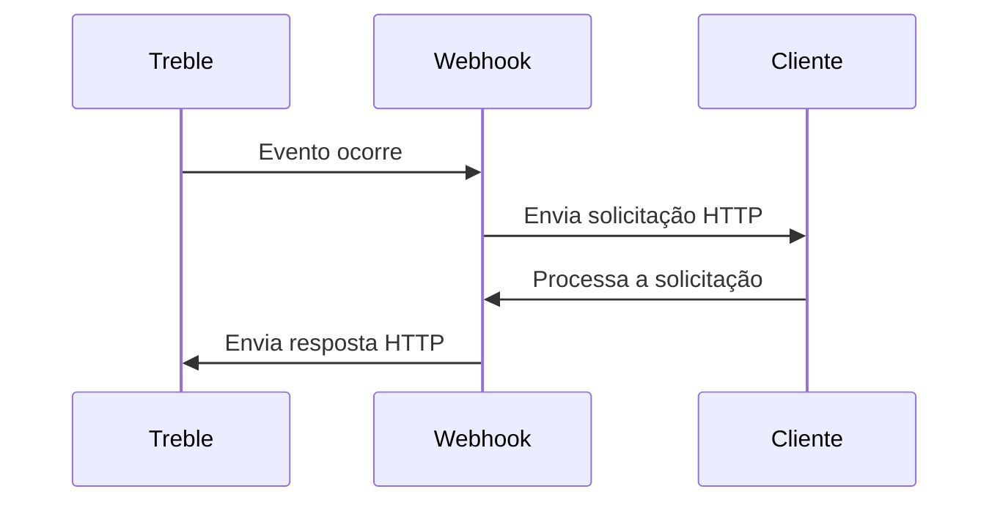

## O que são webhooks?

Os webhooks são uma forma de receber notificações em tempo real sobre eventos específicos na plataforma Treble. A Treble permite configurar webhooks que podem ser usados para múltiplos propósitos, como notificações de eventos de conversas, atualizações de sessões, etc.

A Treble utiliza o sistema de realizar uma chamada ao seu endpoint para notificá-lo dos eventos que estão ocorrendo na plataforma.

### Como funcionam os webhooks?

Quando ocorre um evento na Treble, uma solicitação HTTP POST é enviada para a URL do webhook configurado. Esta solicitação contém informações sobre o evento, que seu servidor pode processar para realizar ações específicas, como atualizar um banco de dados ou enviar uma notificação.



### Benefícios de usar webhooks

- **Eficiência em tempo real:** Receba notificações instantâneas sobre eventos importantes sem necessidade de consultar constantemente a API.
- **Automatização:** Permite automatizar fluxos de trabalho ao desencadear ações automaticamente em resposta a eventos.
- **Flexibilidade:** Podem ser configurados para uma variedade de eventos e personalizados de acordo com as necessidades do negócio.

### Exemplos de uso

- **Notificações de mensagens:** Receber alertas quando uma mensagem é lida ou entregue.
- **Atualizações de estado:** Monitorar mudanças no estado de uma conversa ou sessão.
- **Integrações:** Conectar a Treble com outras aplicações ou serviços para sincronizar dados ou iniciar processos.

Com esta informação adicional, você terá uma compreensão mais completa de como os webhooks podem ser utilizados para melhorar a interação com a plataforma Treble e automatizar processos em seu sistema.

## Que tipos de webhooks existem na Treble?

1. **Webhook de leitura de mensagem:** Este webhook é ativado quando um usuário lê uma mensagem em uma conversa.
2. **Webhook de entrega de mensagem:** Este webhook é ativado quando uma mensagem é enviada a um usuário.
3. **Webhook de opt-out:** Este webhook é ativado quando um usuário opta por não receber mais mensagens.
4. **Webhook de resposta de uma mensagem:** Utilizado para notificar quando é recebida uma resposta de uma mensagem específica de um dos seus fluxos de conversa.
5. **Webhook de fechamento de conversa:** Este webhook é ativado quando uma conversa é fechada.
5. **Webhook de mudança de estado do HSM:** Este webhook é ativado quando um HSM muda de estado.

Alguns dos webhooks mencionados anteriormente devem ser configurados dentro de cada fluxo específico de uma conversa, enquanto outros atuam de forma global na plataforma Treble. Mostramos uma tabela para entender quais são os webhooks que podem ser configurados em cada caso.

| Webhook | Configurado em |
| ------- | -------------- |
| Webhook de leitura de mensagem | Fluxo |
| Webhook de entrega de mensagem | Fluxo |
| Webhook de resposta de uma mensagem | Fluxo |
| Webhook de opt-out | Fluxo |
| Webhook de fechamento de conversa | Globalmente na Treble |
| Webhook de mudança de estado do HSM | Globalmente na Treble |

## O que devo levar em consideração para configurar um webhook?

Você deve ter conhecimento de como receber e processar solicitações HTTP. Adicionalmente, deve ter um servidor ou serviço que possa receber e processar essas solicitações.

### Segurança

- **Autenticação:** Garanta que as solicitações venham de uma fonte confiável. Você pode usar tokens de autenticação ou chaves secretas para verificar a autenticidade das solicitações.
- **Criptografia:** Utilize HTTPS para criptografar as solicitações e proteger os dados em trânsito.

### Validação de Dados

- **Verifique os dados recebidos:** Certifique-se de que os dados na solicitação sejam válidos e completos antes de processá-los.
- **Tratamento de erros:** Implemente um tratamento de erros robusto para responder adequadamente a solicitações malformadas ou não autorizadas.

### Exemplo de Código

Aqui está um exemplo básico de como você poderia configurar um endpoint para receber um webhook em Node.js:

```javascript
const express = require('express');
const app = express();
app.use(express.json());

app.post('/webhook', (req, res) => {
    const { event, data } = req.body;

    // Verifica a autenticidade da solicitação
    if (!isValidRequest(req)) {
        return res.status(401).send('Não autorizado');
    }

    // Processa o evento
    switch (event) {
        case 'message_read':
            handleMessageRead(data);
            break;
        // Trata outros eventos
        default:
            console.log('Evento não reconhecido:', event);
    }

    res.status(200).send('Evento processado');
});

function isValidRequest(req) {
    // Implementa a lógica de validação
    return true;
}

function handleMessageRead(data) {
    console.log('Mensagem lida:', data);
}

app.listen(3000, () => {
    console.log('Servidor escutando na porta 3000');
});
```

### Testes

- **Teste seu endpoint:** Use ferramentas como Postman ou curl para enviar solicitações de teste e garantir que seu servidor responda corretamente.
- **Simule diferentes cenários:** Certifique-se de que seu sistema lide adequadamente com diferentes tipos de eventos e erros.

Com estas dicas e exemplos, você estará melhor preparado para configurar e gerenciar webhooks de maneira eficaz.

## Próximos passos

Nos artigos seguintes, mostramos como configurar cada um dos webhooks mencionados anteriormente. 