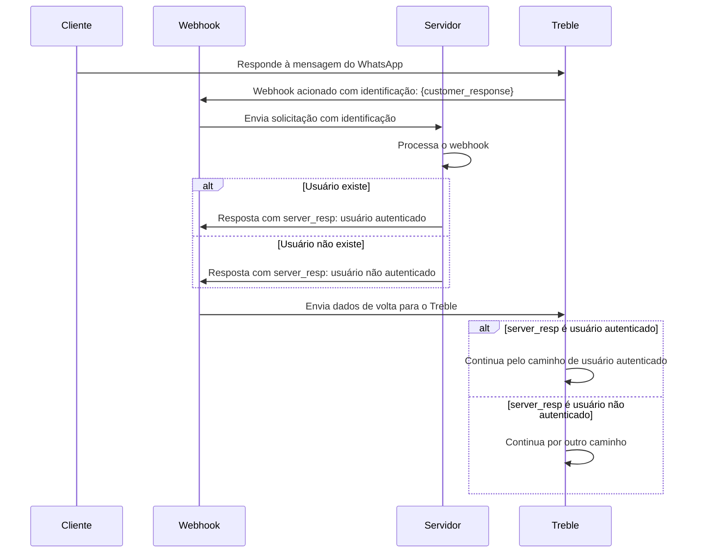

## Como funciona?

Quando um usuário responde a uma mensagem, podemos configurar um webhook para ser acionado e enviar uma solicitação HTTP para o seu endpoint configurado no Treble. Este webhook é um dos mais importantes para implementar casos de uso complexos, como automação de processos ou integração com outras aplicações.

Por exemplo, você pode configurar um webhook para capturar a resposta de um cliente quando ele é solicitado a fornecer seu número de identificação. O Treble enviará uma solicitação HTTP para o seu endpoint configurado no Treble com a resposta do cliente, que você pode processar em sua aplicação. Posteriormente, você pode até retornar informações para a conversa do Treble (fluxo) para exibir informações dinâmicas obtidas pelo seu servidor, ou encaminhar a conversa por outro caminho.

### Diagrama de fluxo do webhook de resposta de mensagem

Neste exemplo, o cliente responde a uma mensagem do WhatsApp com seu número de identificação. O Treble envia uma solicitação HTTP para o seu endpoint configurado no Treble com a resposta do cliente contendo o número de identificação. Seu servidor a processa e retorna informações para o Treble para continuar a conversa.




## Como configurar um webhook de resposta de mensagem?

<Steps>
    <Step title="Acesse o Treble.ai">
        Acesse o Treble.ai através da seguinte URL: <a class="article-link" href="https://app.treble.ai"><p>https://app.treble.ai</p><Icon icon="arrow-up-right-from-square" iconType="solid" /></a>
    </Step>
    <Step title="Crie um fluxo">
        Vá para a seção "Conversas" e clique no botão **"Criar Conversa"**. Você também pode configurar um webhook de leitura de mensagem em um fluxo existente. Para isso, vá para a seção "Fluxos" e clique no botão **"Editar" <Icon icon="pencil" iconType="solid" />** do seu fluxo.

        
    </Step>
    <Step title="Adicione blocos de mensagem">
        Vamos adicionar o primeiro bloco de mensagem. Clique no botão **"Adicionar bloco" <Icon icon="plus" iconType="solid" />**. Neste caso, adicionaremos um modelo de mensagem (HSM) previamente criado e aprovado pela Meta. Em seguida, conectaremos um bloco de mensagem simples com o bloco HSM. Aqui, perguntaremos pelo número de identificação do cliente.

        
    </Step>
    <Step title="Ative o webhook e adicione o endpoint">
        Agora, vamos clicar duas vezes na seta <Icon icon="arrow-right" iconType="solid" /> que sai do bloco de mensagem e se conecta ao bloco de resposta. Um campo de texto aparecerá na parte superior. Neste campo, adicionaremos o endpoint para o qual você deseja que a solicitação HTTP seja enviada quando esta mensagem for lida.

        
    </Step>
    <Step title="Especifique a variável para capturar a resposta">
        É necessário especificar a variável para capturar a resposta do cliente. Vamos clicar duas vezes no bloco de pergunta onde estamos solicitando o número de identificação. No painel que aparece à esquerda, vamos clicar na opção **"Salvar resposta como variável"**. Dois campos aparecerão:

        - **"Tipo de resposta"**: Aqui você pode escolher o tipo de resposta que deseja capturar. Neste caso, escolheremos **"Número"**.
        - **"Nome da variável"**: Aqui você pode adicionar o nome da variável que deseja salvar. Neste caso, adicionaremos `client_id`.

        

        O uso de variáveis no Treble é um conceito-chave para automação de processos. Você pode ler mais sobre elas em:
        <Card 
            title="Variáveis no Treble" 
            icon="book-open"
            href="/pt/docs/build-with-treble/features/variables"
        >
            Saiba mais sobre variáveis no Treble.
        </Card>
    </Step>
    <Step title="Salve as alterações">
        Para que o webhook seja ativado, você deve salvar as alterações. Se você está em um novo fluxo, clique no botão **"Publicar Conversa"** para salvar o fluxo. Se você está em um fluxo existente, clique no botão **"Salvar"** para salvar as alterações.

        <Check>
            Pronto! Agora, quando alguém responder à sua mensagem, o webhook será acionado e enviará uma solicitação HTTP para o seu endpoint configurado no Treble. O corpo da solicitação conterá informações sobre o evento de resposta.
        </Check>
    </Step>
</Steps>

<Card 
    title="Corpo do webhook de resposta de mensagem" 
    icon="book-open"
    href="/pt/api-reference/webhooks/message-response"
>
    Saiba mais sobre o corpo do webhook de resposta de mensagem.
</Card>

## Tutorial Avançado - Resposta do seu servidor

No passo a passo anterior, vimos como configurar um webhook de resposta de mensagem no Treble. Agora, vamos ver como processar a resposta do cliente em seu servidor. Para isso, é necessário que seu servidor tenha um endpoint público para o qual a solicitação HTTP possa ser enviada.

### Passo a Passo

1. **Configure seu servidor:**
   Certifique-se de que seu servidor esteja configurado para receber solicitações HTTP. Você pode usar um framework como Express em Node.js para facilitar este processo.

2. **Crie um endpoint para o webhook:**
   Defina um endpoint em seu servidor que possa receber solicitações de webhook.

3. **Processe a solicitação:**
   Extraia as informações relevantes da solicitação e realize as ações necessárias, como verificar se o usuário existe.

4. **Envie uma resposta para o Treble:**
   Retorne uma resposta para o Treble com as informações processadas, como o status de autenticação do usuário. A resposta deve ser um JSON com o seguinte formato:

   ```json
    {
        "user_session_keys":[
            {
                "key":"server_user_valid",
                "value":"yes"
            }
        ]
    }
   ```

O `user_session_keys` é um array de objetos que contém a chave e o valor da resposta. Para este exemplo, a chave deve ser `server_user_valid` e o valor deve ser `yes` se o usuário existir ou `no` se não existir. No entanto, você pode enviar de volta para o Treble qualquer informação que precise para continuar a conversa. Esta resposta pode conter mais variáveis que podem ser usadas no fluxo.

Exemplo:

```json
{
    "user_session_keys":[
        {
            "key":"user_name",
            "value":"João Silva"
        },
        {
            "key":"last_purchase_date",
            "value":"2025-01-01"
        }
    ]
}
```

### Exemplo de Código

Aqui está um exemplo básico de como você poderia implementar isso em Node.js:

```javascript
const express = require('express');
const app = express();
app.use(express.json());

app.post('/webhook', (req, res) => {
    // Extrair a identificação do usuário dos user_session_keys
    const identification = req.body.user_session_keys.find(key => key.key === 'client_id')?.value;

    // Simular verificação de usuário
    const userExists = verifyUser(identification);

    // Preparar a resposta para o Treble
    const server_resp = userExists ? 'yes' : 'no';

    // Enviar a resposta de volta para o Treble com a estrutura correta
    res.json({
        user_session_keys: [
            {
                key: "server_user_valid",
                value: server_resp
            }
        ]
    });
});

function verifyUser(identification) {
    // Lógica para verificar se o usuário existe
    // Aqui você pode consultar um banco de dados ou um serviço externo
    return identification === '12345'; // Verificação de exemplo
}

app.listen(3000, () => {
    console.log('Servidor ouvindo na porta 3000');
});
```

5. De volta à sua conversa (fluxo) no Treble, conectamos um bloco de condições para avaliar a resposta do servidor. Observe como a variável `server_user_valid` é uma variável de sessão que é salva no fluxo e é a resposta que é enviada para o servidor. O bloco de condições é um bloco do tipo "Se" e avalia se a variável `server_user_valid` é igual a `yes`. Se for, continua pelo caminho do usuário autenticado. Se não, continua por outro caminho.


<Check>
    Pronto! Configuramos um webhook de resposta de mensagem no Treble. Agora, quando alguém responde à sua mensagem, o webhook será acionado e enviará uma solicitação HTTP para o seu endpoint configurado no Treble com a resposta do cliente. Seu servidor a processa e retorna informações para o Treble para continuar a conversa.
</Check>

## Tenha em mente

- Você deve configurar o webhook de resposta para cada resposta (seta <Icon icon="arrow-right" iconType="solid" />) que sai de um bloco de mensagem. Se você configurá-lo em uma única resposta ou na primeira, ele só será ativado para a primeira resposta.

Na imagem a seguir, você pode ver como deve configurar o webhook de resposta para cada uma das 3 respostas que saem de um bloco de mensagem.


<Warning>
    A resposta do seu servidor ao webhook não pode levar mais de 10 segundos. Se seu servidor levar mais de 10 segundos para responder, o webhook será marcado como timeout e o fluxo de conversa no Treble continuará. Você pode estender o tempo de resposta com a opção `[REQUEST_TRIGGER]`. Para mais informações, você pode ler o artigo: <a class="article-link" href="/pt/api-reference/webhooks/request-trigger">Parar conversa do Treble e aguardar resposta do seu servidor</a>.
</Warning> 