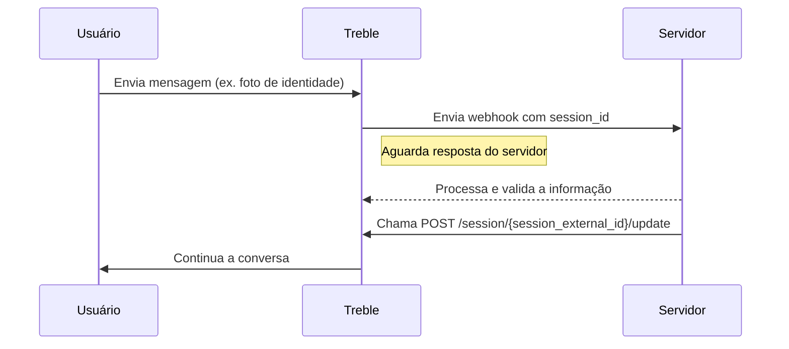

## Request Trigger

Todo webhook do Treble espera uma resposta do seu servidor em menos de 10 segundos. Se o tempo exceder, o webhook será marcado como timeout e a conversa do fluxo no Treble continuará.

No entanto, há momentos em que a conversa do WhatsApp do Treble deve aguardar a resposta do seu servidor. Por exemplo, quando um cliente envia uma foto de sua identidade nacional para validar sua conta e seu servidor precisa processar e validar a imagem. Isso pode levar mais de 10 segundos.

Para isso, você pode parar a conversa do Treble e aguardar a resposta do seu servidor com a opção `[REQUEST_TRIGGER]`. Com a opção `[REQUEST_TRIGGER]`, o Treble aguardará que seu servidor chame o endpoint `POST /session/{session_external_id}/update` para continuar a conversa.



## Como configurar um request trigger?

A configuração de um request trigger consiste em duas partes:

1. A configuração do webhook que é feita no caminho que conecta ao nó (bloco de mensagem) onde você deseja parar a conversa.
2. A configuração do bloco de mensagem que tem uma única opção de resposta, que é o texto: `[REQUEST_TRIGGER]`.

Na imagem a seguir, você pode ver como deve configurar seu fluxo de mensagem para parar e aguardar a resposta do seu servidor.


<Warning>
    Observe que o bloco de mensagem que você deve usar para parar a conversa e aguardar a resposta do seu servidor deve ser um bloco de mensagem não interativo. Ou seja, escolha a opção **Mensagem com opções** e não **Botões Interativos**.

    
</Warning>

Depois de fazer isso, quando seu usuário passar pelo caminho que conecta ao bloco de mensagem com o texto `[REQUEST_TRIGGER]`, o Treble parará a conversa e aguardará a resposta do seu servidor.

### Como continuar a conversa?

Para continuar a conversa, você precisa obter o `session_id` da sessão do Treble que vem como parte do corpo da solicitação do webhook.

Por exemplo:

```json
{
   "country_code": "+57",
   "cellphone":"3161234567",
   "session_id" : "abcsderfwer3252432423-1324325235",
   "conversation_id": 1234,
   "question": {
      "type": "open",
      "text": "Hello world"
   }
   "timeout_at": "2021-10-07 08:53:22.572123",
   "user_session_keys":[]
}
```

Aqui precisamos extrair o `session_id` e usá-lo para chamar o endpoint `POST /session/{session_external_id}/update`.

<Card 
    title="Atualizar uma sessão" 
    icon="code"
    href="/pt/api-reference/endpoints/session-update"
>
    Atualizar uma sessão para continuar a conversa.
</Card>

Lembre-se que ao fazer a chamada para o endpoint `POST /session/{session_external_id}/update`, você também pode incluir no corpo da solicitação o `user_session_keys`, ou seja, variáveis de sessão que podem ser usadas para continuar a conversa.

<Check>
   Pronto! Você configurou com sucesso um request trigger em seu fluxo de mensagem.
</Check> 